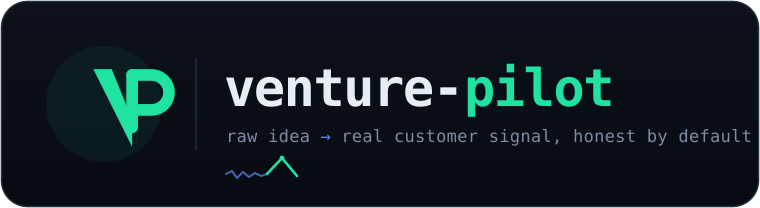

<!-- ╔══════════════════════════════════════════════════════════════════════╗ -->
<!-- ║                          v e n t u r e - p i l o t                     ║ -->
<!-- ╚══════════════════════════════════════════════════════════════════════╝ -->

<div align="center">



<h3>From a raw idea to signal you can bet on — fast, cited, and honest enough to act on.</h3>

<p>
An AI co-pilot that does the painful connective-tissue work around real customer discovery —<br>
and tells you the truth about what it finds, <strong>including when the truth is <em>stop</em>.</strong>
</p>

<p>


</p>

<p>
<a href="#-the-problem">Why</a> ·
<a href="#-what-it-does">What it does</a> ·
<a href="#-try-it-in-60-seconds">Quickstart</a> ·
<a href="#-the-honest-verdict">The verdict</a> ·
<a href="#-principles">Principles</a> ·
<a href="#-status-and-roadmap">Roadmap</a>
</p>

</div>

---

<div align="center">


<sub><strong>This is <code>vp</code> running for real</strong> — recorded live on a Claude subscription (real web-search sources, a real <code>7/7</code>-grounded verdict). <em>Plan → <strong>you</strong> approve → cited research (it abstains when there's no source) → drafted artifacts (nothing sent) → <strong>you</strong> run the interviews → an honest <strong>STOP / PIVOT / CONTINUE</strong> verdict where every cited quote is checked verbatim against the transcripts.</em></sub>

<sub>👉 Runs on <strong>any LLM you want</strong> — your Claude&nbsp;Pro/Max subscription, an Anthropic API key, or any OpenAI-compatible model (incl. <strong>local</strong>). No offline fakery; it always uses a real model. <a href="#-try-it-in-60-seconds">Set it up ↓</a></sub>

</div>

<br>

> **What this is.** venture-pilot is a human-in-the-loop workspace for first-time and pre-seed founders. It is **not** another "type an idea, get a 78/100" toy, and **not** a fire-and-forget "AI employee." It preps and synthesizes the work around real customer discovery — *you* run the conversations and make every call.
>
> **Long-term vision:** an agentic co-founder that orchestrates the business functions around building a startup (research, product, GTM, ops). We earn that by first nailing **one** painful, recurring, verifiable job — not by faking the whole company on day one.

---

## 🎯 The problem

Every "idea validator" on the market is a flattery machine. You type your idea, it returns a confident **78/100**, a glossy SWOT, and a pat on the back. None of it touches a real customer. None of it is allowed to tell you the answer that actually saves your year:

> **Stop. Nobody is going to pay for this.**

Real founders don't die from a missing score. They die from **mistaking politeness for demand** — "I'd totally use that!" from someone who never will — and burning twelve months building it. The hard, unglamorous, genuinely valuable job is separating *genuine buying signal* from *being nice to your face*, and being honest about the result.

That's the one job venture-pilot is built to do well first.

---

## ✦ What it does

For a pre-seed / first-time founder with an idea, it runs the discovery wedge end-to-end — **research is automatic, every irreversible action waits for you:**

| # | Step | What the agent does | Who acts |
|:-:|------|---------------------|:--------:|
| **1** | 🧭 **Find the customers** | Read-only research that surfaces the exact target customers + communities, with a **real source link behind every claim**. | agent |
| **2** | ✍️ **Draft the outreach** | A tailored outreach + interview script for those specific people. | agent → *you send* |
| **3** | 📄 **Build the test artifact** | A focused landing page / one-page pitch you can put in front of real humans. | agent → *you publish* |
| **4** | ⚖️ **Synthesize the signal** | You run the conversations; it ingests your notes/transcripts, separates **buying intent from politeness**, and issues an evidence-cited **STOP / PIVOT / CONTINUE** verdict — every line linked to a real quote or source. | *you interview* → agent |

**You make the calls. The agent preps and synthesizes.** Nothing gets **sent, published, solicited, or launched** without your explicit approval.

---

## ⚖ The honest verdict

The headline feature is also the least-verifiable one — you only find out a verdict was *wrong* months later. So venture-pilot treats it like an instrument that must be calibrated, not an oracle to be trusted. It returns one of three honest answers, and **shows its work:**

| Verdict | Means | Grounded in |
|---------|-------|-------------|
| 🟥 **STOP** | No credible demand for this idea, from this person. | the quotes that *aren't* there |
| 🟧 **PIVOT** | Real, paid demand exists — but for a *different* problem or segment than you pitched. | the signal pointing elsewhere |
| 🟩 **CONTINUE** | Credible, substantiated demand for the idea **as pitched**. | behavior + money + urgency, quoted verbatim |

It weighs **substance over tone** — money already spent on a workaround, specific past behavior, urgency, an asking price — and is explicitly *not* fooled by enthusiasm ("genius!", "I'd definitely use it") or by a gruff tone that hides real pain. When the evidence isn't there, it **abstains** instead of inventing a number.

---

## 🚀 Try it in 60 seconds

```bash
git clone <this-repo> && cd venture-pilot
pip install -e .

# Point it at an LLM (see the table below). Easiest: log into Claude once —
# then vp runs on your subscription with no API key.
vp doctor                            # confirm which backend you're on

# 1) prep cited research + draft artifacts for an idea (you approve the plan)
vp validate "Slack bot that summarizes long threads for managers"

# 2) you run the interviews yourself, then synthesize them into one honest verdict
vp synthesize ./interviews/*.md
```

`vp` **always uses a real LLM** (no offline mode) and **auto-picks whichever you've set up** — run `vp doctor`, or force one with `--api` / `--sdk` / `--openai`:

| Backend | Enable it | What it is |
|---|---|---|
| ⚡ **`--sdk`** | run `claude` once to log in (the Agent SDK ships with the app) | a **Claude Pro/Max subscription** — no API key. Easiest if you already have Claude. |
| 🔑 **`--api`** | `cp .env.example .env` → add your `ANTHROPIC_API_KEY` (+ `VP_MODEL`) | **bring your own Anthropic key** — pay-per-token, ~pennies/run |
| 🟣 **`--openai`** | set `VP_OPENAI_MODEL` (+ `VP_OPENAI_BASE_URL` / `OPENAI_API_KEY`) | **any OpenAI-compatible LLM** — OpenAI, OpenRouter (→ Claude/GPT/Gemini/Llama), Groq, or a **local** model (Ollama / LM Studio) |

- `vp validate` writes real **draft** artifacts to `out/` (interview script, outreach DMs, a landing page) and **abstains** on any research claim it can't source.
- `vp synthesize` reads the sample transcripts in [`interviews/`](interviews/) and returns an honest verdict where **every cited quote is verified verbatim** against the transcripts. Fabricated quotes are flagged, never shown as fact.
- Hard caps on steps / tokens / cost with a kill-switch apply to every live run; a full JSON trace lands in `out/trace.jsonl` — pretty-print it with **`vp trace`**.

<details>
<summary><strong>Under the hood — the Phase 0.1 honesty eval + the tests</strong></summary>

The verdict is only trusted because a separate eval proves a model beats a naive tone-follower *first*:

```bash
# the honesty gate — the naive baseline FAILS on purpose (~11%), which proves the eval discriminates
cd eval && python run_eval.py --mode mock

# deterministic tests (stubbed transports, no network): 19 app + 19 eval = 38
python -m pytest vp/tests -q          # from the repo root
cd eval && python -m pytest -q
```

The real model has to beat that naive tone-follower by ≥20 points before the verdict ships ([`eval/`](eval/)).
</details>

---

## 🛡 Principles

*Why people will actually come back — the opposite of every flattery machine:*

<table>
<tr>
<td width="50%" valign="top">

#### 🫀 Honesty over cheerleading
Every incumbent outputs a feel-good 78/100. venture-pilot will tell you to **stop**, and show you exactly why.

</td>
<td width="50%" valign="top">

#### 🔗 Provenance over assertion
Every market claim links to its source. Every claimed outcome is a logged, verifiable event — never a number we just assert. **Outcomes can't be faked.**

</td>
</tr>
<tr>
<td width="50%" valign="top">

#### 🔬 Cite-then-verify
Facts are grounded in retrieved sources and entailment-checked. When the evidence isn't there, the agent **abstains** instead of hallucinating.

</td>
<td width="50%" valign="top">

#### 🚦 Human gates on anything irreversible
**Plan → preview → approve → execute.** Read-only research runs freely; anything with a side effect asks first.

</td>
</tr>
<tr>
<td colspan="2" valign="top">

#### 📊 Bounded & observable
Hard caps on steps / tokens / cost with a kill-switch, and full traces of every step, tool, and source. No runaway agents, no black boxes.

</td>
</tr>
</table>

---

## 📦 What's in this repo

Built in the open. The wedge is implemented as an early **`vp`** MVP that runs on any LLM today; the verdict stays gated by the Phase 0.1 eval. What's public:

| Path | What it is |
|------|-----------|
| [**`vp/`**](vp/) | The **app** — a single-writer orchestrator + read-only cited research, draft-only artifacts, and the verdict synthesizer, with enforced caps + full tracing. `vp validate` / `vp synthesize`. Design in [`vp/IMPLEMENTATION.md`](vp/IMPLEMENTATION.md). |
| [`interviews/`](interviews/) | Eight sample interview transcripts so `vp synthesize` runs end-to-end out of the box. |
| [**`eval/`**](eval/) | The **Phase 0.1 verdict eval** — proves a model separates genuine signal from politeness before the verdict is trusted. 18 labeled transcripts (with *politeness traps*), scoring, a pass/fail gate, 19 tests. |
| [`docs/assets/`](docs/assets/) | Brand assets + the VHS `demo.tape` that records the demo GIF straight from the real CLI. |

> The full **strategy, architecture, roadmap, GTM, and business-model** docs are kept **private while the idea is validated.** The code and the eval are public on purpose — they're the part that proves or kills the thesis.

---

## 🗺 Status and roadmap

**Phase 0 — validation, with an early MVP in hand.** The honesty thesis is being proven on a labeled eval set, and the wedge now exists as a runnable `vp` MVP that runs on **any LLM** — a Claude subscription, an Anthropic key, or any OpenAI-compatible model. It leads with *verifiable artifacts* (cited research + landing page); the headline verdict is trusted **only while the Phase 0.1 eval clears its gate.**

```
Phase 0  ░ De-risk before code      → kill/redesign gates                  ← validating now
Phase 1  ░ Verifiable-artifact MVP  → cited research + landing page        ← vp MVP built
Phase 2  ░ The honest verdict       → STOP/PIVOT/CONTINUE                   ← vp MVP built
Phase 3  ░ Escape one-shot churn    → recurring weekly signal digest
Phase 4  ░ Expand toward the vision → only after a retention floor
```

Each phase is a **kill/redesign gate** — validation before code. The detailed roadmap, gates, and milestones are kept private during validation.

---

## 🤝 Follow the build

There are no fake users here and there won't be — but if the honesty wedge resonates, you can help prove it out:

- ⭐ **Star / watch** the repo to follow the validation in public.
- 🧪 **Run it** — `pip install -e . && vp validate "<your idea>"` — and open an issue with what you find.
- 🗣️ **Bring real transcripts.** The eval gets sharper with real, redacted interview data — see [`eval/data/RUBRIC.md`](eval/data/RUBRIC.md) for the labeling standard.
- 💡 **Disagree well.** The fastest way to improve an honesty tool is an adversarial counter-example. PRs and issues welcome.

---

<div align="center">
<sub>Built in the open · validation before code · honesty over cheerleading.</sub>
<br>
<sub>Permanent guardrail: <strong>send / publish / solicit / launch stays human-gated, always.</strong></sub>
</div>
